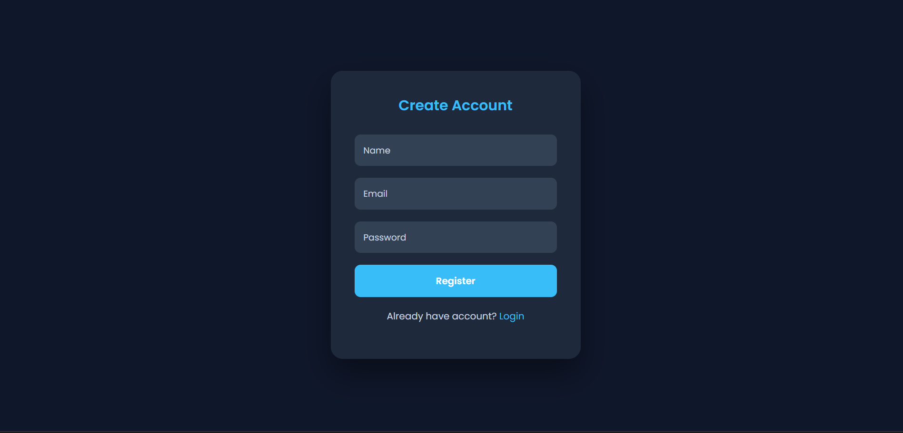
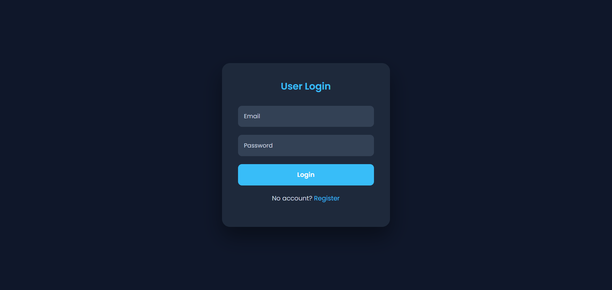
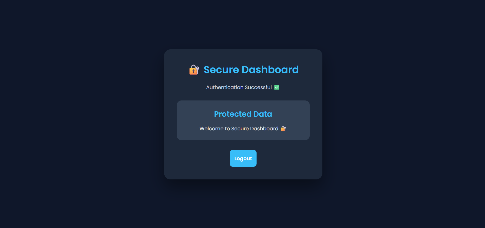
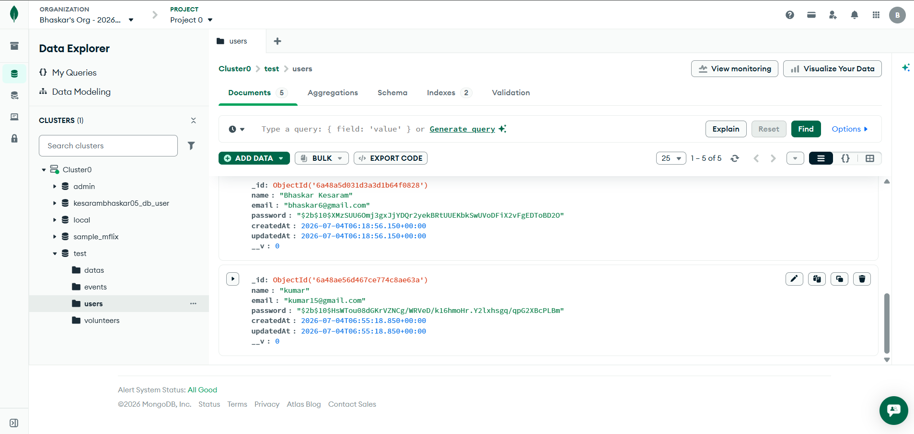

# 🔐 Database Authentication System

## 📌 Project Overview

Database Authentication System is a full-stack web application developed as part of the **Cognifyz Technologies Full Stack Development Internship - Task 6**.

This project demonstrates secure user authentication with database integration. Users can register, login, receive JWT authentication tokens, and access protected resources only after authorization.

---

## 🚀 Features

- 👤 User Registration
- 🔑 Secure User Login
- 🔒 Password Encryption
- 🎫 JWT Token Authentication
- 🛡 Protected API Routes
- 💾 MongoDB Database Integration
- 🔐 Authorization Middleware
- 🚪 Logout Functionality
- 📱 Responsive Authentication UI
- ⚡ REST API Communication

---

## 🛠 Tech Stack

### Frontend

- HTML5
- CSS3
- JavaScript
- Fetch API
- LocalStorage

### Backend

- Node.js
- Express.js
- MongoDB Atlas
- Mongoose

### Security

- bcrypt
- JSON Web Token (JWT)
- Authentication Middleware

### Tools

- VS Code
- Postman
- Git & GitHub

---

# 📂 Project Structure

```bash
Task-6-Database-Authentication

│
├── backend
│
│   ├── config
│   │    └── db.js
│
│   ├── controllers
│   │    └── authController.js
│
│   ├── middleware
│   │    └── authMiddleware.js
│
│   ├── models
│   │    ├── User.js
│   │    └── Data.js
│
│   ├── routes
│   │    ├── authRoutes.js
│   │    └── dataRoutes.js
│
│   ├── server.js
│   ├── package.json
│   └── .env
│

├── frontend
│
│   ├── register.html
│   ├── login.html
│   ├── dashboard.html
│
│   ├── css
│   │    └── style.css
│
│   └── js
│        ├── auth.js
│        └── dashboard.js
│

├── screenshots

└── README.md
```

---

# ⚙️ Installation

Clone Repository

```bash
git clone <repository-url>
```

---

## Backend Setup

Navigate:

```bash
cd backend
```

Install dependencies:

```bash
npm install
```

Create `.env`

```env
PORT=5000

MONGO_URI=your_mongodb_connection_string

JWT_SECRET=your_secret_key
```

Start server:

```bash
npm run dev
```

Output:

```bash
Server running on 5000

MongoDB Connected
```

---

# 🔗 API Endpoints


## Register User

```http
POST /api/auth/register
```

Example:

```json
{
"name":"Bhaskar Kesaram",
"email":"bhaskar@gmail.com",
"password":"12345678"
}
```

---

## Login User

```http
POST /api/auth/login
```

Response:

```json
{
"success":true,
"token":"JWT_TOKEN"
}
```

---

## Protected Dashboard

```http
GET /api/data/dashboard
```

Header:

```text
Authorization: Bearer Token
```

---

# 🔐 Authentication Flow

```text
User Register

      ↓

Password Encrypted (bcrypt)

      ↓

Stored in MongoDB

      ↓

User Login

      ↓

JWT Token Generated

      ↓

Token Stored in Browser

      ↓

Access Protected Dashboard
```

---

# 📸 Screenshots

## Register Page




## Login Page




## Secure Dashboard



## mognodb-users 



---

# 📚 Concepts Implemented

- MVC Backend Architecture
- REST API Development
- Database Integration
- Password Hashing
- JWT Authentication
- Middleware Authorization
- Protected Routes
- Frontend Authentication Flow

---

# 👨‍💻 Developed By

**Bhaskar Kesaram**

Full Stack Developer

---

# ⭐ Acknowledgement

Developed as part of the **Cognifyz Technologies Full Stack Development Internship Program**.
